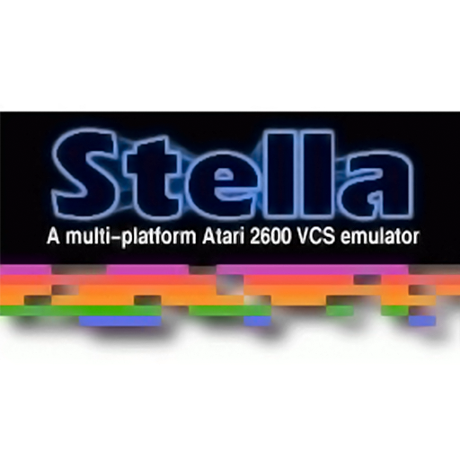
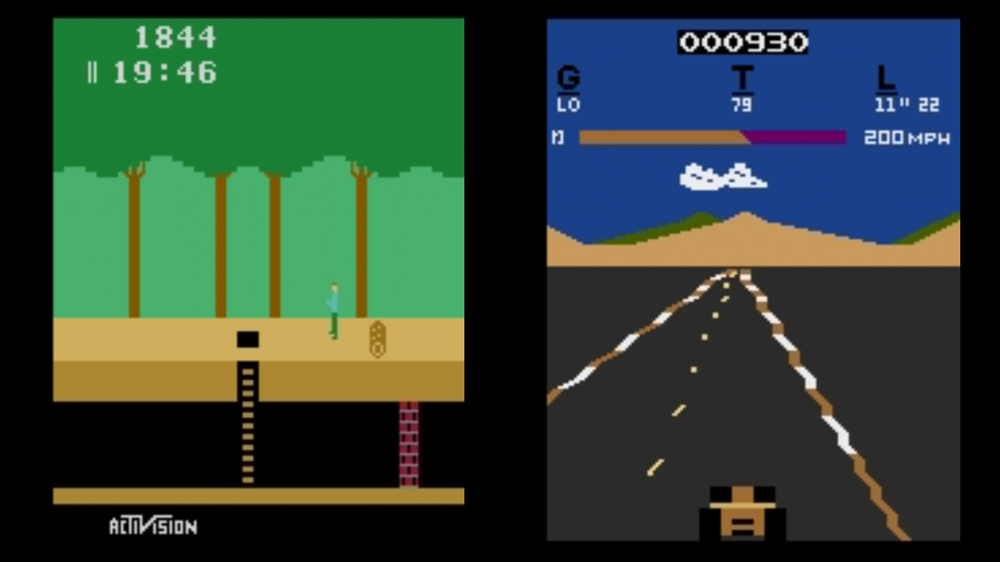
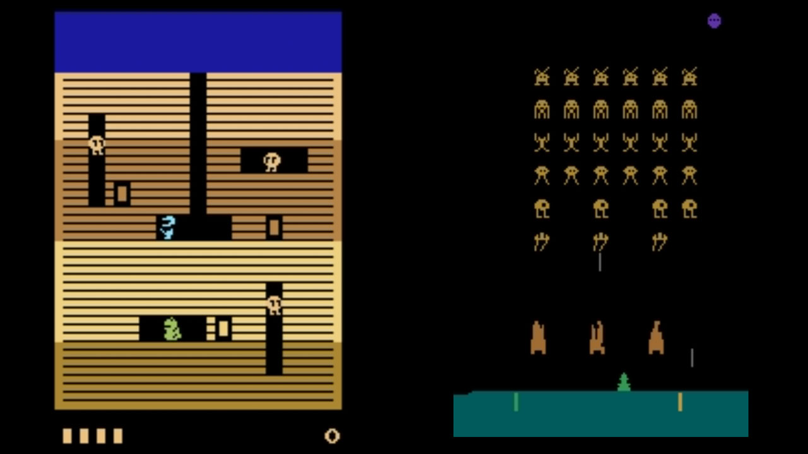
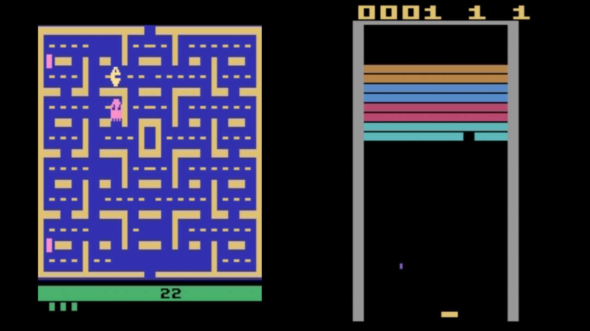

# Atari - 2600 (Stella 2014)

### Description

Stella is a multi-platform Atari 2600 VCS emulator.

The Atari 2600 Video Computer System (VCS), introduced in 1977, was the most popular home video game system of the early 1980s.

### License

GPLv2

### Icon

### Fanart

Help make me fanart!

### Screenshots

### Disclaimer

*Stella was originally developed for Linux by Bradford W. Mott, and is currently maintained by Stephen Anthony.*
